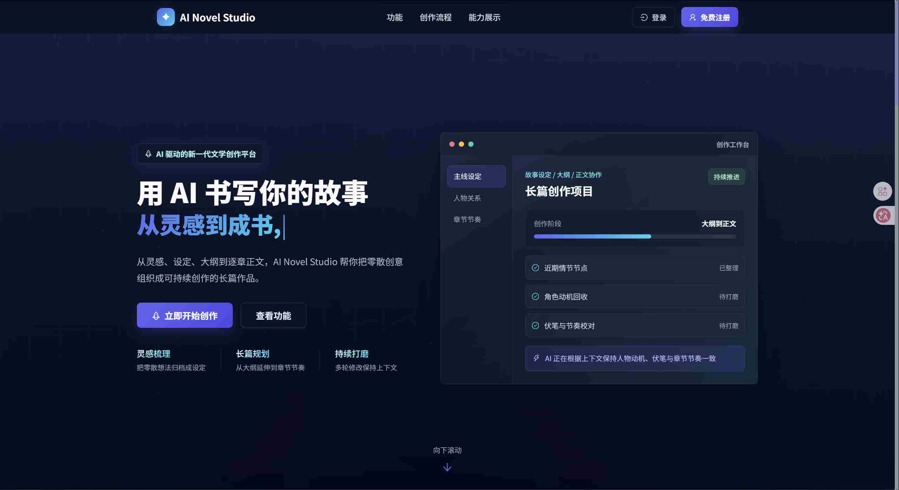
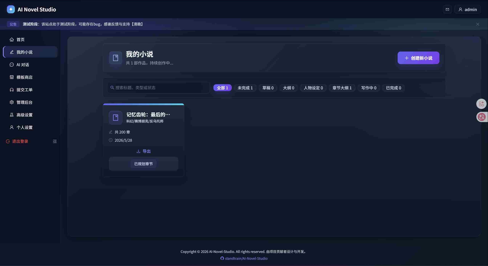
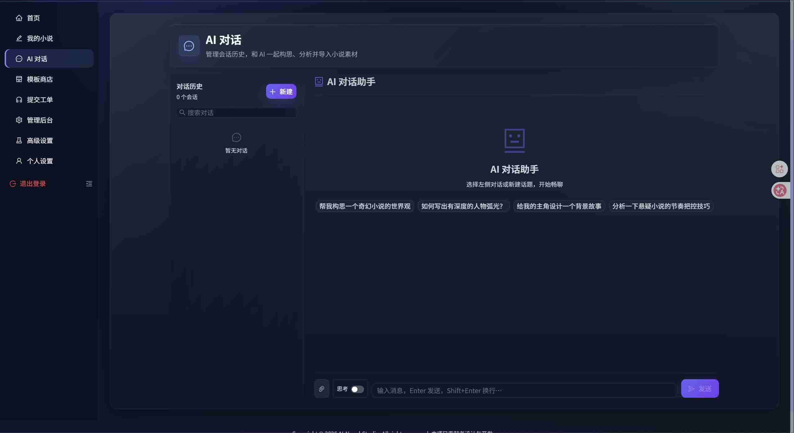
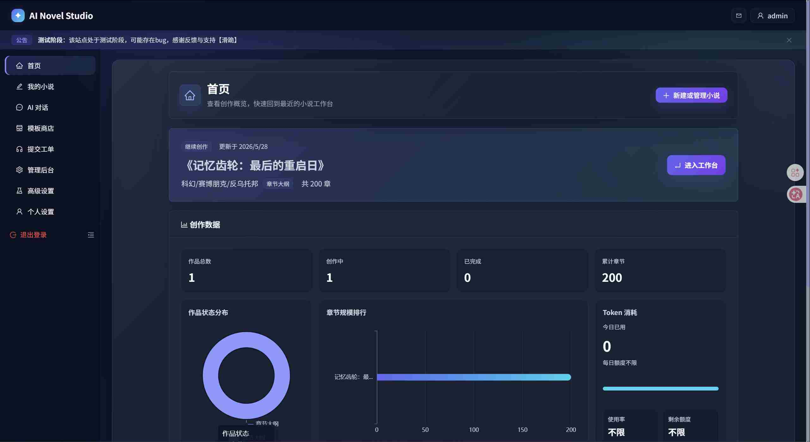
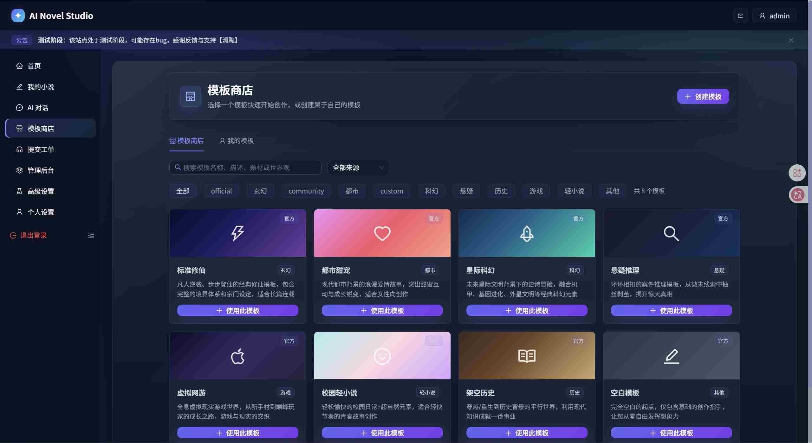
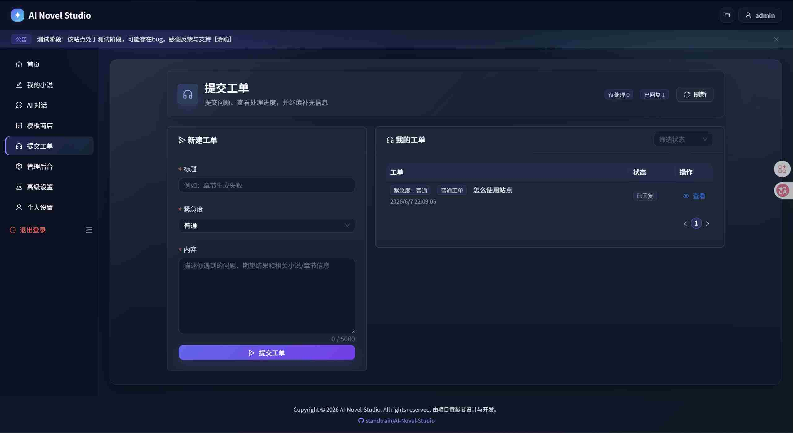
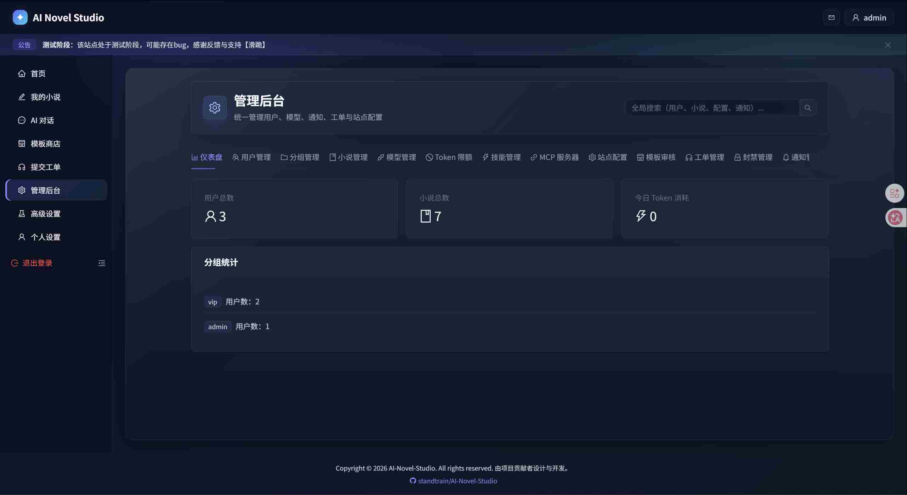

**中文** | [English](./README_EN.md)

# BookAgent - AI 小说写作平台

一个面向网文创作者的智能写作平台，提供从灵感到成稿的完整工作流。平台不是简单的"AI 代写工具"，而是一个**人机协作的创作工作台** — 作者掌控故事方向，AI 负责结构化分析、上下文维护和内容生成，让创作者专注于想象力而非重复劳动。

由站着跑的火车（standtrain）使用手搓+vibe coding的方式完成。

感谢AI时代，让个人开发者也可以轻松快速的进行大型项目的开发。



## 目录

- [为什么选择 BookAgent](#为什么选择-bookagent)
- [商业优势](#商业优势)
- [功能一览](#功能一览)
- [系统架构](#系统架构)
- [技术栈](#技术栈)
- [项目结构](#项目结构)
- [快速开始](#快速开始)
- [部署指南](#部署指南)
- [API 概览](#api-概览)
- [常见问题](#常见问题)
- [许可证](#许可证)

## 为什么选择 BookAgent

### 1. 全流程结构化创作

大多数 AI 写作工具只提供"对话式生成"，一次性输出往往导致剧情断裂和角色崩坏。BookAgent 将创作过程拆解为**大纲 → 人设 → 章纲 → 正文**四个明确阶段，每个阶段有独立的 Agent 处理：

- **大纲阶段** — 分析题材、设定世界观、规划主线与支线
- **人设阶段** — 提取角色性格、能力、关系网，生成结构化档案
- **章纲阶段** — 逐章规划摘要、关键事件、出场角色、章尾钩子
- **写作阶段** — 基于章纲和上下文流式生成正文，保持前后连贯

每个阶段产出可独立审查、修改，不满意可回溯重新生成，确保每一步都在作者掌控之中。



### 2. 智能导入：保留你的原文

粘贴已有小说文本，平台会：
- 自动识别章节边界（支持"第X章"、"Chapter N"等多种格式）
- AI 分析小说概览并提取角色信息
- 为已提交的章节保留**原始内容**，不覆盖、不改写
- 仅推断**缺失的前置章节**大纲（如提交第5-8章，自动推断第1-4章），不生成后续内容
- 支持补充意见引导 AI 分析方向

这个设计让已有存稿的作者可以无缝迁移到平台，不用担心 AI 篡改已有内容。

### 3. 多 Provider 智能路由

不同创作阶段对模型能力的要求不同。BookAgent 支持按阶段分配不同的 AI 模型：

```json
[
  {
    "name": "openai",
    "baseUrl": "https://api.openai.com/v1",
    "apiKey": "sk-xxx",
    "models": [{"name": "gpt-4o", "phases": ["outline", "characters"]}]
  },
  {
    "name": "deepseek",
    "baseUrl": "https://api.deepseek.com/v1",
    "apiKey": "sk-xxx",
    "models": [{"name": "deepseek-chat", "phases": ["write_chapter"]}]
  }
]
```

用强模型做大纲和人设（需要创意和逻辑），用高性价比模型写正文（需要速度和成本优势），灵活组合。支持以下生产级特性：

- **并发限制** — 控制每个 Provider 的最大并发请求数，防止 API 限流
- **失败冷却** — 某个 Provider 连续失败时自动暂停，冷却期后恢复
- **同优先级轮询** — 多个同级别模型轮流调用，分散负载
- **自动故障转移** — 主模型不可用时自动切换到备用模型

### 4. 逐阶段温度控制

支持为 12 个创作阶段独立设置模型温度（随机性），精确控制每个环节的 AI 输出风格：

| 阶段 | 推荐温度 | 说明 |
|------|---------|------|
| 规划 (planning) | 0.8-1.0 | 激发创意，探索多种可能 |
| 大纲 (outline) | 0.7-0.9 | 构思主线，保持适度发散 |
| 人设 (characters) | 0.7-0.9 | 塑造鲜明角色 |
| 章纲 (chapter_outline) | 0.5-0.7 | 结构清晰，逻辑连贯 |
| 写作 (write_chapter) | 0.3-0.5 | 稳定输出，风格一致 |
| 审查 (review) | 0.1-0.3 | 精准分析，客观评判 |
| 修订 (revise) | 0.3-0.5 | 保持原文风格的一致性修改 |

每位用户可独立配置自己的温度偏好，互不影响。

### 5. 上下文记忆管理

长篇小说写作的核心挑战是**连贯性**。BookAgent 的 ContextManager 实现了：

- **章节摘要滚动窗口** — 自动维护最近 50 章的摘要，超过 100 条时自动裁剪，平衡上下文丰富度与 Token 成本
- **角色信息持久化** — 角色设定全程可访问，写作时自动注入到 Prompt 中
- **对话历史管理** — 记录 AI 交互过程，支持上下文回溯
- **延迟持久化** — 脏标记 + 定时器（默认 5 秒），减少数据库写入频率，提升性能
- **中断恢复** — 上下文状态持久化到 MySQL，服务重启后自动恢复，不丢失进度

### 6. MCP 双向集成

支持 Model Context Protocol，既可以作为 MCP 客户端调用外部工具，也可以作为 MCP 服务端暴露平台能力：

**作为服务端** — 将小说管理能力暴露为 MCP 工具，供 Claude、Cursor 等外部 AI 应用调用：
- `list_novels` — 列出小说项目
- `get_novel` — 获取小说详情
- `create_novel` — 创建新小说
- `write_chapter` — 生成章节内容

**作为客户端** — 在写作过程中调用外部 MCP 工具（如搜索引擎、知识库查询），丰富创作素材。新增 MCP 服务器时默认预填 AnySearch 模板配置，降低接入门槛。

### 7. 技能系统

支持自定义技能注入，扩展 AI 的写作能力：
- 为特定创作阶段附加专业提示词（如"玄幻战斗场景描写"、"古风对话润色"）
- 全局写作风格指令，统一全书语调
- 技能可按阶段（outline / characters / write_chapter / all）精确匹配
- 支持管理员预设公共技能 + 用户自定义个人技能

### 8. AI 通用对话

独立的对话模块，支持多轮 AI 对话：
- Markdown 渲染回复内容
- 工具调用（Tool Choice）支持
- 思考过程（Thinking）展示，让用户理解 AI 决策过程
- 文件引用和上下文关联
- 会话历史持久化，支持跨设备继续对话



### 9. 实时流式输出

所有 AI 生成均采用 SSE（Server-Sent Events）实时流式传输：
- 逐字呈现，无需等待完整响应
- 支持中途取消（AbortController）
- 进度回调显示当前阶段和完成百分比
- 后端 `proxy_buffering off` 确保 Nginx 下无延迟

### 10. 多格式导出

支持 5 种导出格式，满足不同场景需求：

| 格式 | 用途 | 技术实现 |
|------|------|---------|
| TXT | 纯文本，通用兼容 | 直接流式写入 |
| DOCX | Word 文档，便于编辑排版 | docx 库，支持中文排版 |
| PDF | 正式文档，保持格式一致 | pdfkit + 内嵌中文字体 |
| EPUB | 电子书，适配阅读器 | epub-gen |
| JSON | 结构化数据，便于二次开发 | 完整数据结构导出 |

导出范围支持全书、单章、指定章节区间，大纲单独导出。

### 11. 移动端适配

全平台响应式设计：
- 弹窗宽度自适应（移动端 `95vw`）
- 表单布局自动堆叠
- 步骤条紧凑模式
- 触摸设备优化（删除按钮可见性提升）
- 流式输出区域高度自适应

### 12. 安全与运维

- **JWT 鉴权** — 全 API 接口认证，支持 Token 过期续签
- **邮箱验证码登录** — 支持邮箱验证码注册/登录/找回密码
- **速率限制** — 登录限流 + 全局限流，防止滥用
- **Token 统计** — 记录每次 AI 调用的 Token 消耗，支持按用户/小说/时间维度查询
- **用户分组** — 管理员/普通用户权限隔离，可自定义每日 Token 配额、速率限制、导出权限
- **结构化日志** — pino 日志系统，支持生产环境日志采集
- **环境变量管理** — 敏感配置不入代码，`.env` 文件纳入 `.gitignore`
- **安全响应头** — X-Content-Type-Options、X-Frame-Options、Referrer-Policy、Permissions-Policy
- **动态 CORS** — 管理员后台可控开关，支持自定义允许来源


## 商业优势

BookAgent 不仅仅是一个开源项目，更是一套**开箱即用的 SaaS 商业解决方案**。以下特性使其在商业化场景中具备显著竞争力：

### 💰 成本可控

- **多 Provider 按阶段路由** — 创意阶段用强模型，批量生成用性价比模型，综合成本降低 40%-60%
- **Token 消耗实时统计** — 按用户、小说、时间维度追踪，精准成本核算
- **用户配额管理** — 管理员可为不同用户组设置每日 Token 上限，防止成本超支
- **上下文自动裁剪** — 智能管理上下文窗口，避免无效 Token 消耗

### 🏢 多租户架构

- **用户分组与权限** — 内置管理员/普通用户角色，支持自定义分组
- **独立配置隔离** — 每位用户可独立配置温度偏好、技能、模型选择
- **配额灵活分配** — 按用户组设置 Token 配额、速率限制、导出权限
- **模板市场** — 用户可创建、分享、复用小说模板，形成内容生态

### 🔌 API 优先设计

- **RESTful API** — 所有功能均通过标准化 API 暴露，便于第三方集成
- **MCP 服务端** — 将写作能力暴露为 MCP 工具，可被 Claude、Cursor 等 AI 工具调用
- **SSE 流式输出** — 支持实时数据传输，提升用户体验
- **Webhook 扩展点** — 可在关键事件（章节完成、导出就绪等）触发外部回调（规划中）

### 🛡️ 企业级安全

- **JWT 认证 + 自动续签** — 成熟的鉴权体系
- **速率限制** — 登录限流 + API 限流，防止滥用和 DDoS
- **动态 CORS 管理** — 管理员后台控制跨域访问来源
- **安全响应头** — 默认开启主流安全头部
- **结构化日志** — pino 日志系统，支持对接 ELK、Grafana 等监控平台
- **环境变量隔离** — 敏感配置不入代码，支持多环境部署

### 📈 规模化部署

- **PM2 Cluster 模式** — 充分利用多核 CPU，单机可承载数百并发用户
- **Nginx 反向代理** — 支持负载均衡、SSL  termination、静态资源缓存
- **MySQL 持久化** — 成熟的关系型数据库，支持主从复制、读写分离
- **无状态服务设计** — 后端服务无状态，支持水平扩展

### 🎨 白标化能力

- **站点配置管理** — 管理员可通过后台修改站点名称、Logo、品牌信息
- **法律页面自定义** — 服务条款、隐私政策等页面支持自定义内容
- **主题可定制** — 基于 Ant Design 5 的主题系统，支持品牌色定制
- **域名独立部署** — 每个实例可绑定独立域名，适合为不同客户独立部署

### 🔄 生态扩展性

- **MCP 客户端集成** — 可接入搜索引擎、知识库、图片生成等外部工具
- **技能市场** — 写作技能可沉淀、复用、交易，形成技能生态
- **模板市场** — 小说模板可共享，降低新用户创作门槛
- **多 Provider 兼容** — 兼容所有 OpenAI 格式 API，包括 DeepSeek、通义千问、Moonshot 等

### 📊 商业模式适配

BookAgent 的架构天然支持以下商业模式：

| 模式 | 实现方式 |
|------|---------|
| **SaaS 订阅** | 用户分组 + Token 配额 + 速率限制，按套餐等级区分服务 |
| **按量计费** | Token 统计 + 配额管理，按实际消耗计费 |
| **企业私有部署** | 独立部署 + 白标定制 + 域名绑定 |
| **技能/模板交易** | 模板市场 + 技能系统，平台抽成模式 |
| **API 服务** | MCP 服务端 + REST API，为第三方提供写作能力 |
| **内容授权** | 多格式导出，支持与阅读平台、出版社对接 |

## 功能一览

### 创作工作台
- 智能导入（保留原文 + 推断前置章节）
- 整书大纲生成（支持重新生成和手动调整）
- 人物设定生成与编辑（角色关系图谱）
- 章节大纲逐章生成（支持批量生成）
- 逐章正文流式写作（实时流式输出）
- 章节审查与重新生成（不满意可回溯）
- AI 内容修订（局部改写，保持整体连贯）
- 手动触发 / 批量续写（自动续写后续章节）
- 写作进度追踪（完成百分比、字数统计）



### 通用功能
- AI 通用对话（多轮对话 + 工具调用 + 思考过程展示）
- 模板商店（创建/分享/复用小说模板）
- 技能系统（自定义写作技能注入，公共技能 + 个人技能）
- MCP 工具集成（客户端 + 服务端双向集成）
- 站内信通知（系统公告 + 个人消息）
- 用户工单支持（问题反馈与处理流程）
- 邮箱验证码认证（注册/登录/找回密码）





### 系统管理
- 多 AI Provider 配置与智能路由
- 用户注册/登录/分组/权限管理
- 模型 Token 限额配置（按用户组设置）
- MCP 服务器管理（增删改查 + 模板预填）
- 通知公告管理（全体/分组推送）
- 工单处理（查看/回复/关闭）
- 站点配置（品牌信息、法律页面、CORS 设置）
- 数据导出（TXT/DOCX/PDF/EPUB/JSON）
- 管理员后台面板（独立的系统管理界面）



## 系统架构

```
┌─────────────────────────────────────────────────────────┐
│                        Nginx                            │
│  ┌──────────────────┐  ┌─────────────────────────────┐  │
│  │  静态资源 (dist)  │  │  反向代理 /api/* → Node.js  │  │
│  └──────────────────┘  └─────────────────────────────┘  │
└─────────────────────────────────────────────────────────┘
                              │
┌─────────────────────────────┴───────────────────────────┐
│                    PM2 Cluster (多实例)                   │
│  ┌──────────┐  ┌──────────┐  ┌──────────┐              │
│  │ Express  │  │ Express  │  │ Express  │  ...         │
│  │ 实例 #1  │  │ 实例 #2  │  │ 实例 #3  │              │
│  └────┬─────┘  └────┬─────┘  └────┬─────┘              │
│       │              │              │                    │
│       └──────────────┼──────────────┘                    │
│                      │                                   │
│  ┌───────────────────┴───────────────────────────────┐  │
│  │                  业务层                             │  │
│  │  ┌─────────┐ ┌──────────┐ ┌──────────────────┐   │  │
│  │  │ Routes  │→│ Services │→│ DAO (Knex.js)     │  │  │
│  │  │ (18模块)│ │ (16模块) │ │ (22个DAO文件)     │  │  │
│  │  └─────────┘ └──────────┘ └──────────────────┘   │  │
│  │                                                        │  │
│  │  ┌──────────────────────────────────────────────┐  │  │
│  │  │            AI Agent 层 (7 个 Agent)           │  │  │
│  │  │  规划 → 导入 → 大纲 → 人设 → 章纲 → 写作 → 审查/修订  │  │
│  │  └──────────────────────┬───────────────────────┘  │  │
│  │                         │                             │  │
│  │  ┌──────────────────────┴───────────────────────┐  │  │
│  │  │        ContextManager (上下文管理)            │  │  │
│  │  │  章节摘要滚动窗口 │ 角色信息 │ 对话历史 │ 延迟持久化 │  │
│  │  └──────────────────────────────────────────────┘  │  │
│  └──────────────────────┬────────────────────────────┘  │
│                         │                                 │
│  ┌──────────────────────┴────────────────────────────┐  │
│  │                   数据层                            │  │
│  │  ┌──────────────────┐  ┌──────────────────────┐  │  │
│  │  │   MySQL 8.0      │  │  文件存储 (uploads/)  │  │  │
│  │  │  (37个迁移文件)   │  │  (导入文件/导出缓存)  │  │  │
│  │  └──────────────────┘  └──────────────────────┘  │  │
│  └──────────────────────────────────────────────────┘  │
└─────────────────────────────────────────────────────────┘
                              │
┌─────────────────────────────┴───────────────────────────┐
│                   外部服务                                │
│  ┌──────────┐  ┌──────────┐  ┌────────────────────┐    │
│  │ OpenAI   │  │ DeepSeek │  │ 其他 OpenAI 兼容   │    │
│  │ API      │  │ API      │  │ API Provider       │    │
│  └──────────┘  └──────────┘  └────────────────────┘    │
│  ┌──────────┐  ┌──────────┐                            │
│  │ SMTP     │  │ MCP 外部 │                            │
│  │ 邮件服务 │  │ 工具服务 │                            │
│  └──────────┘  └──────────┘                            │
└─────────────────────────────────────────────────────────┘
```

### 数据流说明

1. **用户请求** → Nginx 反向代理 → Express 路由 → Service 业务层 → DAO 数据层 → MySQL
2. **AI 生成请求** → Route → Agent → Provider Router → 外部 AI API → SSE 流式返回
3. **上下文注入** → Agent 调用前，ContextManager 自动从数据库加载相关上下文，拼接到 Prompt
4. **MCP 调用** → 外部 AI 工具 → MCP Endpoint → MCP Server → Service → 响应
5. **文件导出** → Service → 对应格式生成器 → 文件流返回 → 浏览器下载

## 技术栈

| 层级 | 技术 | 选型理由 |
|------|------|---------|
| 前端框架 | React 18 + TypeScript | 成熟的生态，强类型保障代码质量 |
| UI 组件库 | Ant Design 5 | 企业级组件库，丰富的表单/表格/弹窗组件 |
| 状态管理 | Zustand | 轻量级，无模板代码，支持持久化中间件 |
| 构建工具 | Vite 5 | 极快的冷启动和 HMR |
| 后端框架 | Node.js + Express 5 | 高性能异步 I/O，适合 SSE 流式传输 |
| 数据库 | MySQL 8.0 + Knex.js | 成熟稳定，Knex 提供 SQL 构建和迁移管理 |
| 输入校验 | Zod | TypeScript 优先的 schema 校验库，类型安全 |
| AI 集成 | OpenAI 兼容 API | 支持所有遵循 OpenAI 格式的 API 提供商 |
| 认证 | JWT (jsonwebtoken) + bcrypt + 邮箱验证码 | 成熟安全的认证方案 |
| 文件处理 | Multer (上传) + Mammoth (DOCX) + word-extractor (DOC) | 多种格式兼容 |
| 文档导出 | pdfkit + docx + epub-gen | 服务端直接生成，无需额外依赖 |
| 邮件 | nodemailer / resend | 支持多种邮件发送方式 |
| 验证码 | svg-captcha | 轻量级图形验证码 |
| 日志 | pino | 高性能结构化日志 |
| 部署 | PM2 (cluster 模式) + Nginx | 进程守护 + 负载均衡 + 静态资源服务 |

## 项目结构

```
bookagent/
├── backend/
│   ├── assets/fonts/              # 中文字体（PDF 导出用）
│   ├── migrations/                # 数据库迁移文件（37 个）
│   ├── seeds/                     # 初始数据种子
│   ├── sql/init.sql               # 完整 SQL 初始化脚本
│   ├── src/
│   │   ├── config/                # 数据库、OpenAI/Provider、JWT 配置
│   │   ├── constants/             # 常量定义（法律文本、写作提示词默认值）
│   │   ├── core/
│   │   │   ├── agents/            # AI Agent（大纲/人设/章纲/写作/导入/审查/规划）
│   │   │   │   ├── planningAgent.js      # 创作规划 Agent
│   │   │   │   ├── importAgent.js        # 智能导入分析 Agent
│   │   │   │   ├── outlineAgent.js       # 大纲生成 Agent
│   │   │   │   ├── characterAgent.js     # 人设生成 Agent
│   │   │   │   ├── chapterOutlineAgent.js # 章纲生成 Agent
│   │   │   │   ├── writingAgent.js       # 正文写作 Agent
│   │   │   │   └── reviewAgent.js        # 审查与修订 Agent
│   │   │   ├── mcp/                # MCP 客户端/服务端/工具适配器
│   │   │   │   ├── client.js       # MCP 客户端（调用外部工具）
│   │   │   │   ├── server.js       # MCP 服务端（暴露平台能力）
│   │   │   │   └── adapter.js      # 工具适配器（标准 MCP ⇄ 内部格式）
│   │   │   └── utils/              # 上下文管理、字数统计
│   │   │       └── contextManager.js # 核心上下文管理模块
│   │   ├── dao/                    # 数据访问层（22 个 DAO 文件）
│   │   ├── middleware/             # 鉴权、限流、Token 统计
│   │   ├── routes/                 # REST API 路由（18 个模块）
│   │   │   ├── auth.js             # 认证（注册/登录/邮箱验证码/找回密码）
│   │   │   ├── novels.js           # 小说 CRUD
│   │   │   ├── agent.js            # AI 生成接口
│   │   │   ├── chapters.js         # 章节管理
│   │   │   ├── export.js           # 多格式导出
│   │   │   ├── chat.js             # AI 通用对话
│   │   │   ├── mcp.js              # MCP 工具管理
│   │   │   ├── templates.js        # 模板商店
│   │   │   ├── skills.js           # 技能系统
│   │   │   ├── inmails.js          # 站内信
│   │   │   ├── tickets.js          # 用户工单
│   │   │   ├── site.js             # 站点公共配置
│   │   │   └── admin/              # 管理后台路由（用户/站点/Provider/MCP/公告/工单/技能）
│   │   ├── services/               # 业务逻辑层（16 个服务文件）
│   │   ├── scripts/                # 管理脚本（创建管理员等）
│   │   └── utils/                  # 日志、请求解析等工具
│   ├── uploads/                    # 用户上传文件目录
│   ├── .env.example                # 环境变量模板
│   ├── ecosystem.config.js         # PM2 集群配置
│   └── knexfile.js                 # Knex 数据库连接配置
├── frontend/
│   ├── src/
│   │   ├── api/                    # API 封装（含 SSE 流式调用）
│   │   ├── components/             # 组件
│   │   │   ├── admin/              # 管理后台组件
│   │   │   ├── dashboard/          # 用户仪表盘组件
│   │   │   ├── novel-workbench/    # 小说创作工作台组件
│   │   │   ├── layout/             # 布局组件（导航/侧栏/页脚）
│   │   │   ├── settings/           # 设置组件
│   │   │   └── shared/             # 共享通用组件
│   │   ├── hooks/                  # 自定义 React Hooks
│   │   ├── pages/                  # 页面（15 个页面模块）
│   │   │   ├── Login.tsx           # 登录/注册页
│   │   │   ├── Dashboard.tsx       # 用户仪表盘
│   │   │   ├── NovelWorkbench.tsx  # 小说创作工作台（核心页面）
│   │   │   ├── Chat.tsx            # AI 通用对话页
│   │   │   ├── TemplateStore.tsx   # 模板商店
│   │   │   ├── Skills.tsx          # 技能管理
│   │   │   ├── Tickets.tsx         # 工单系统
│   │   │   ├── Inmails.tsx         # 站内信
│   │   │   ├── Settings.tsx        # 个人设置
│   │   │   └── admin/              # 管理后台页面
│   │   ├── store/                  # Zustand 状态管理
│   │   │   ├── authStore.ts        # 认证状态
│   │   │   └── novelStore.ts       # 小说创作状态
│   │   ├── styles/                 # 全局样式
│   │   └── App.tsx                 # 主应用组件（路由 + Ant Design 主题配置）
│   ├── vite.config.ts
│   └── tsconfig.json
├── deploy/                         # 部署包输出目录
├── start.sh                        # Linux/macOS 启动脚本
├── start.bat                       # Windows 启动脚本
└── package.sh                      # 打包部署脚本
```

## 快速开始

### 环境要求

- Node.js 18+
- MySQL 8.0+
- npm（推荐使用 nvm 管理 Node.js 版本）

### 安装依赖

```bash
# 后端
cd backend && npm install

# 前端
cd frontend && npm install
```

### 配置环境变量

```bash
cp backend/.env.example backend/.env
```

编辑 `backend/.env`，填写数据库连接、JWT 密钥、AI API 配置：

```env
# 数据库
DB_HOST=127.0.0.1
DB_PORT=3306
DB_USER=${DB_USER}
DB_PASSWORD=${DB_PWD}
DB_NAME=novel_writing

# JWT（请使用强随机字符串，推荐 openssl rand -hex 64 生成）
JWT_SECRET=your_jwt_secret

# AI Provider（单 Provider 简易模式）
OPENAI_BASE_URL=https://api.openai.com/v1
OPENAI_API_KEY=sk-xxx
OPENAI_MODEL=gpt-4o

# 多 Provider 模式（设置后忽略上方单 Provider 配置）
# 格式：JSON 数组，每个 Provider 可配置多个模型，按阶段分配
# OPENAI_PROVIDERS=[{"name":"openai","baseUrl":"https://api.openai.com/v1","apiKey":"sk-xxx","models":[{"name":"gpt-4o","phases":["all"]}]},{"name":"deepseek","baseUrl":"https://api.deepseek.com/v1","apiKey":"sk-xxx","models":[{"name":"deepseek-chat","phases":["outline","write_chapter"]}]}]

# 邮箱验证码（可选，用于邮箱注册/登录/找回密码）
# SMTP_HOST=smtp.example.com
# SMTP_PORT=587
# SMTP_USER=noreply@example.com
# SMTP_PASS=your_smtp_password

# 日志级别（开发用 debug，生产用 info）
LOG_LEVEL=debug

# 服务端口
PORT=3000
```

### 初始化数据库

```bash
cd backend
npm run migrate       # 创建表结构（运行 37 个迁移文件）
npm run seed          # 写入初始配置数据
npm run create-admin  # 创建管理员账号（交互式输入用户名和密码）
```

### 启动开发服务

```bash
# 后端（默认 http://localhost:3000）
cd backend && npm run dev

# 前端（默认 http://localhost:5173）
cd frontend && npm run dev
```

启动后访问 `http://localhost:5173`，使用创建的管理员账号登录。

## 部署指南

### 生产环境检查清单

部署前请确认以下事项：

- [ ] 数据库密码已更换为强密码
- [ ] JWT_SECRET 已更换为随机字符串（64 位以上）
- [ ] `.env` 文件中的 API Key 已配置
- [ ] `.env` 文件权限已设置为 `600`
- [ ] Nginx 已配置 SSL 证书（生产环境必须 HTTPS）
- [ ] 防火墙仅开放 80/443 端口
- [ ] 已配置日志轮转（防止日志占满磁盘）

### 打包

```bash
# 构建前端
cd frontend && npx vite build

# 执行打包脚本（自动排除 node_modules、.env、日志文件等）
bash package.sh
```

打包脚本会自动生成 `deploy/deploy-bookagent.tar.gz`，包含后端源码和前端的构建产物。

### Linux 服务器部署

```bash
# 上传并解压
scp deploy/deploy-bookagent.tar.gz user@server:/opt/
ssh user@server "cd /opt && tar -xzf deploy-bookagent.tar.gz"

# 安装生产依赖（跳过 devDependencies）
cd /opt/backend && npm install --production

# 配置环境变量
cp .env.example .env && vim .env

# 初始化数据库
npm run migrate && npm run seed && npm run create-admin

# 使用 PM2 启动（cluster 模式，实例数 = CPU 核心数）
pm2 start ecosystem.config.js
pm2 save          # 保存进程列表，重启后自动恢复
pm2 startup       # 设置开机自启
```

### PM2 集群配置示例

`backend/ecosystem.config.js` 参考配置：

```javascript
module.exports = {
  apps: [{
    name: 'bookagent',
    script: './src/index.js',
    instances: 'max',        // 自动使用所有 CPU 核心
    exec_mode: 'cluster',
    env: {
      NODE_ENV: 'production'
    },
    max_memory_restart: '1G', // 内存超过 1G 自动重启
    log_date_format: 'YYYY-MM-DD HH:mm:ss',
    error_file: './logs/error.log',
    out_file: './logs/out.log',
    merge_logs: true
  }]
};
```

### Nginx 参考配置

```nginx
server {
    listen 80;
    server_name your-domain.com;
    return 301 https://$server_name$request_uri;  # HTTP → HTTPS
}

server {
    listen 443 ssl http2;
    server_name your-domain.com;

    # SSL 证书
    ssl_certificate     /etc/nginx/ssl/your-domain.crt;
    ssl_certificate_key /etc/nginx/ssl/your-domain.key;

    # 安全头部
    add_header X-Content-Type-Options nosniff;
    add_header X-Frame-Options DENY;
    add_header X-XSS-Protection "1; mode=block";
    add_header Referrer-Policy strict-origin-when-cross-origin;

    # 前端静态资源
    location / {
        root /opt/frontend/dist;
        try_files $uri $uri/ /index.html;
        expires 7d;                       # 静态资源缓存
        add_header Cache-Control "public, immutable";
    }

    # 后端 API
    location /api/ {
        proxy_pass http://127.0.0.1:3000;
        proxy_http_version 1.1;
        proxy_set_header Upgrade $http_upgrade;
        proxy_set_header Connection "upgrade";
        proxy_set_header Host $host;
        proxy_set_header X-Real-IP $remote_addr;
        proxy_set_header X-Forwarded-For $proxy_add_x_forwarded_for;
        proxy_set_header X-Forwarded-Proto $scheme;
        proxy_buffering off;              # SSE 流式输出必须关闭缓冲
        proxy_read_timeout 300s;          # AI 生成可能耗时较长
    }

    # MCP 端点（供外部 AI 工具调用）
    location /api/mcp-endpoint {
        proxy_pass http://127.0.0.1:3000;
        proxy_http_version 1.1;
        proxy_set_header Host $host;
        proxy_set_header X-Real-IP $remote_addr;
        proxy_set_header X-Forwarded-For $proxy_add_x_forwarded_for;
    }

    # 上传文件大小限制
    client_max_body_size 50m;

    # Gzip 压缩
    gzip on;
    gzip_types text/plain text/css application/json application/javascript text/xml application/xml text/javascript;
    gzip_min_length 1000;
}
```

### 运维命令参考

```bash
# PM2 管理
pm2 list                    # 查看进程状态
pm2 logs bookagent          # 查看实时日志
pm2 reload bookagent        # 零停机重启
pm2 restart bookagent       # 强制重启
pm2 monit                   # 实时监控面板

# 数据库备份
mysqldump -u ${DB_USER} -p novel_writing > backup_$(date +%Y%m%d).sql

# 日志查看
tail -f /opt/backend/logs/out.log
tail -f /opt/backend/logs/error.log
```

## API 概览

| 模块 | 路径前缀 | 说明 |
|------|----------|------|
| 认证 | `/api/auth` | 注册、登录、邮箱验证码、找回密码、个人资料管理 |
| 小说 | `/api/novels` | 小说 CRUD、导入、大纲/角色/章节数据存取、统计 |
| Agent | `/api/novels` | AI 生成：规划、导入分析、大纲、人设、章纲、写作、审查、修订 |
| 章节 | `/api/novels/:id/chapters` | 章节内容读写 |
| 导出 | `/api/novels` | TXT/DOCX/PDF/EPUB/JSON 多格式导出 |
| 对话 | `/api/chat` | AI 通用多轮对话（支持工具调用和 Markdown 渲染） |
| MCP | `/api/mcp` | MCP 工具管理与调用 |
| MCP 端点 | `/api/mcp-endpoint` | MCP 服务端端点（供外部 AI 工具接入） |
| 模板 | `/api/templates` | 模板商店（创建/搜索/复用） |
| 技能 | `/api/skills` | 技能系统（用户技能查询） |
| 站内信 | `/api/inmails` | 站内通知消息 |
| 工单 | `/api/tickets` | 用户支持工单 |
| 站点 | `/api/site` | 公共站点配置（品牌信息、法律页面） |
| 管理 | `/api/admin` | 用户管理、站点配置、Provider 管理、模型限额、通知公告、工单处理、技能管理、MCP 管理 |

所有 API 接口（除 `/api/auth` 中的注册/登录和 `/api/site` 的公共配置外）均需 JWT 鉴权，请求头携带 `Authorization: Bearer <token>`。

## 常见问题

### Q: 支持哪些 AI 模型？

所有兼容 OpenAI API 格式的模型均支持，包括但不限于：OpenAI GPT-4o/GPT-4、DeepSeek V3/R1、通义千问、Moonshot、智谱 GLM 等。通过多 Provider 配置可以同时接入多个模型服务商。

### Q: 智能导入会修改我的原文吗？

不会。已提交章节的原始内容会被完整保留，AI 仅分析和提取信息。生成操作仅对未提交的章节生效。

### Q: 上下文记忆能支持多长的小说？

默认维护最近 50 章摘要，超过 100 条自动裁剪。对于更长的小说，旧的摘要会被清理但角色信息永久保留。根据实际测试，此机制可支撑 200 万字以上的长篇创作。

### Q: 如何控制 AI 调用成本？

通过多 Provider 路由机制，在创意阶段使用强模型，批量写作阶段使用性价比模型，可将综合成本降低 40%-60%。管理员还可为用户组设置每日 Token 配额上限。

### Q: 支持团队协作吗？

当前版本以个人创作为主，支持管理员/普通用户的分组管理。多用户协作编辑同一小说的功能在规划中。

## 许可证

本项目基于 [Apache License 2.0](http://www.apache.org/licenses/LICENSE-2.0) 开源。

Apache 2.0 许可证允许商业使用、修改和再分发，但需保留原始版权声明和许可证信息。
